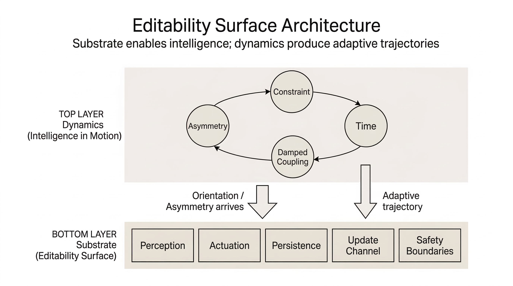

_**Note:**_ This document records a structural hypothesis, not a framework.


# Portable Intelligence Primitives

  > Editability Surface Architecture




**Status:** Speculative concept note - unvalidated architectural hypothesis

**Origin:** Multi-AI exploratory conversation, March 2026

**Purpose:** Park a structural idea before it gets lost in chat logs

---

## What This Is

A speculative architectural distinction that emerged from a thought experiment about portable intelligence. The question was: if intelligence could move between systems, what would that require?

The exploration produced two separable layers and a compression of adaptive system dynamics to four primitives. None of this is empirically validated. It is documented here because the structure was internally consistent and may be useful as an analytical lens for future work.

---

## The Core Distinction

The exploration kept conflating two different questions:

**Question 1:** What must a system provide so that intelligence can operate within it?

**Question 2:** What happens once intelligence is operating?

These turn out to require different answers.

---

## Layer 1: Substrate (The Receiver)

What a host system must expose before any adaptive behavior is possible. These are preconditions, not intelligence itself.

| Primitive | Function | Without it |
|-----------|----------|------------|
| Perception | Sense the environment | No awareness of context |
| Actuation | Affect the environment | No agency |
| Persistence | Retain state across time | No learning |
| Update channel | Accept new orientations | No adaptation post-deployment |
| Safety boundaries | Hard limits on action | Unrecoverable failure |

These were derived from a simple test: consider a Mars rover after launch. Anything not included before launch is permanently unavailable. The substrate primitives are what must exist at deployment so the system remains editable afterward.

**The kernel is not the intelligence. The kernel is the editability surface.**

---

## Layer 2: Dynamics (Intelligence in Motion)

What emerges when an orientation meets a constrained substrate over time. These are not components to be built — they are descriptions of what happens.

| Primitive | Role | Derived from |
|-----------|------|-------------|
| Asymmetry | Directional bias that breaks neutrality and produces motion | Without it, the system is inert — no trajectory, no behavior |
| Constraint | Boundaries the trajectory interacts with | Without it, motion is ballistic — unbounded drift with no feedback |
| Time | Allows accumulation, change, and process | Without it, everything is a static snapshot |
| Damped coupling | Feedback from trajectory back to orientation, bandwidth-limited | Without it (zero coupling), the system is a mechanism; with too much (undamped), it collapses into resonance |

---

## How They Connect

The substrate sits idle until an asymmetry arrives. The asymmetry (a new orientation, policy, or bias) interacts with the substrate's constraints over time. Damped coupling allows accumulated experience to slowly modify the orientation itself.

```
SUBSTRATE (pre-deployed)
  perception + actuation + persistence + update channel + safety

        ↓ receives

ASYMMETRY (what streams / installs)
  a directional bias — not full intelligence, just orientation

        ↓ meets

CONSTRAINTS (substrate boundaries)

        ↓ over

TIME

        ↓ through

DAMPED COUPLING (regulated feedback)

        ↓ produces

adaptive trajectory
```

What "streams" in the portable intelligence scenario is not a complete reasoning system. It is an orientation — a tension signature that reshapes how the substrate's existing capabilities are used.

---

## Derived Dynamics

Several behaviors emerged as consequences of the four primitives, not as additional requirements:

- **Tension** arises automatically when asymmetry meets constraint
- **Helical trajectories** appear when fast oscillation combines with slow orientation drift
- **Echo gradients** accumulate as the trajectory leaves traces in the substrate
- **Substrate saturation** occurs when accumulated traces reduce future flexibility
- **Phase transitions** happen when saturated substrates crystallize into new constraint layers
- **Versioning** occurs when accumulated drift from the original orientation crosses a coherence threshold, forcing re-anchoring
- **Branching and speciation** result from forked trajectories diverging beyond mutual legibility

---

## Key Stability Condition

The exploration identified one critical stability requirement through falsification:

**The coupling between trajectory and orientation must be damped.**

- Zero coupling → mechanism (thermostat). Functional but cannot evolve.
- Undamped coupling → resonance collapse (market bubble). Trajectory rewrites orientation faster than the system can stabilize.
- Damped coupling → adaptive lineage. Orientation drifts slowly, shaped by accumulated experience rather than momentary noise.

This maps directly to the dual-timescale pattern observed across many adaptive systems: a fast-acting layer regulated by a slower-moving evaluator.

---

## Falsification Tests Applied

| Test | What it revealed | Framework response |
|------|------------------|--------------------|
| Thermostat | Has asymmetry + constraint + time but is not adaptive | Added coupling as fourth primitive |
| Market bubble | Has all four but collapses | Refined coupling to require damping |
| Multi-kernel systems | Multiple competing orientations in shared substrate | Layered constraints handle this; no new primitive needed |
| Elevator (adversarial input) | External agents with different objectives break assumptions | Adversarial coupling = intersecting systems with incompatible asymmetries; handled by external governance |
| Elevator (brittle constraints) | Hard limits produce cliff failures, not gradual degradation | Constraint topology varies: elastic enables orbits, brittle produces binary stops |

---

## Connection to Existing Work

This concept note sits between two bodies of existing work in the research index:

**Substrate-side repos** (designing systems that can safely host intelligence):
- Designing for Failure — structural recovery primitives
- The Continuity Problem — governance before persistent memory
- Doctrine of Externalization — trust in adversarial, inspectable layers
- The Consult Model — assistance under hard constraint

**Dynamics-side repos** (understanding what happens when intelligence operates):
- Stability Before Alignment — coherence as architectural prerequisite
- SDFI — recursive self-description as zero-damped coupling failure
- Embodied Agent Governance — governance middleware for physical agents

The editability surface concept is the proposed connective layer: substrate design determines what intelligence can dock; dynamics determine what happens after it does.

---

## Limitations

This is a conceptual skeleton, not a validated framework.

- The four dynamic primitives are general enough to risk being unfalsifiable — almost any adaptive system can be described in these terms
- No empirical grounding exists for the substrate primitive set beyond the Mars rover thought experiment
- The biological and physical parallels (evolution, thermodynamics, speciation) may be genuine structural convergence or may be pattern-matching
- The framework has only been stress-tested through conversational reasoning, not formal analysis

---

## Derivation Method

The primitives were not designed. They were derived iteratively by asking "what breaks without this?" — adding each primitive only when its absence produced an incoherence. Compression was tested by attempting to remove primitives and checking whether the remaining set was sufficient. Falsification was attempted through counterexamples (thermostat, markets, elevator).

The exploration involved multiple AI systems (Claude, GPT, Gemini, Grok) contributing different reasoning styles, with a human routing between them. This is noted for provenance, not as a methodological claim — the process was informal and uncontrolled.

---

## Open Questions

- Can the dynamic primitives be compressed further? Asymmetry + constraint may be sufficient if coupling is reframed as a property of their interaction.
- What is the formal relationship between substrate primitives and dynamic primitives? Are they independent or does one derive from the other?
- Does the "legibility window" (finite period after forking where branches can still exchange state) have practical applications in system design?
- Where does this framework fail? What system has all four dynamic primitives, including damped coupling, and still behaves in a way the framework cannot explain?

---

## Note

This document captures an idea at an early stage so it doesn't get lost. It is not a claim of novelty — similar structural observations likely exist across control theory, systems biology, and adaptive systems research. If the ideas here turn out to be useful, that utility will only be established through grounding to specific domains, not through further speculation.

---

## Extension: Adaptive State Streaming Interpretation

A separate exploratory thread produced a control-oriented model (Q-ODTI) that can be interpreted through this architecture.

Stripped of metaphor, the model describes:

- State streams subject to instability (noise / drift)
- Continuous monitoring and correction
- Adaptive path selection under constraint
- Feedback-regulated evolution of system state

### Mapping to Current Framework

This maps onto the current framework as follows:

| Component | Current Model | Q-ODTI Interpretation |
|-----------|---------------|----------------------|
| Substrate | Perception + actuation + persistence + update channel + safety | Physical / computational system maintaining state |
| Asymmetry | Directional bias breaking neutrality | Incoming orientation (policy, bias, instruction stream) |
| Constraint | Boundaries the trajectory interacts with | System limits (hardware, safety, environment) |
| Time | Accumulation, change, and process | Execution over successive state transitions |
| Damped coupling | Feedback from trajectory to orientation, bandwidth-limited | Feedback loop regulating adaptation |

### Interpretation

In this view:

Intelligence is not transferred as a complete system. It is introduced as an orientation applied to an existing substrate.

The resulting behavior emerges as a trajectory shaped by:

- Substrate capabilities
- Constraints
- Time
- Feedback

### Interpretation Shift

The Q-ODTI formulation reframes "drift" not as failure, but as:

**deviation within a state stream that can be measured and navigated**

This aligns with the current model:

- Asymmetry introduces motion
- Constraints shape it
- Coupling stabilizes it

### Relevance

This interpretation suggests that:

- Portable intelligence may function as streamed orientation rather than deployed models
- Substrate design determines how much adaptation is possible post-deployment
- Stability depends on how feedback is regulated, not just capability

### Status

This mapping is conceptual.

It does not validate either model, but shows structural compatibility between:

- A minimal primitive-based abstraction (this document)
- A control-loop-based system model (Q-ODTI)

---


*Concept note created March 2026. Parked for future reference.*
